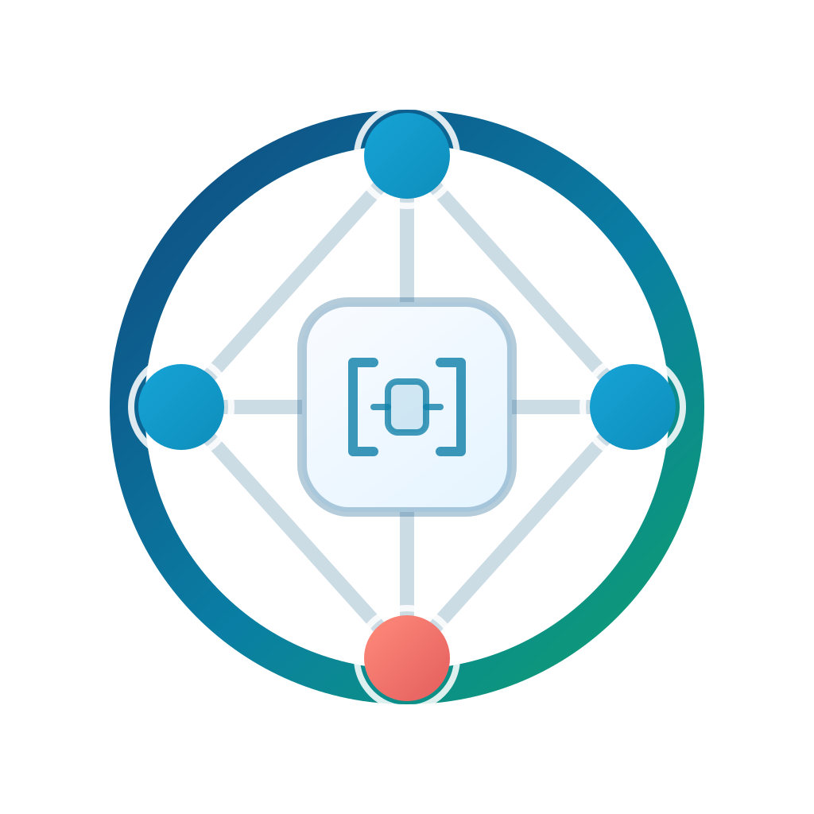
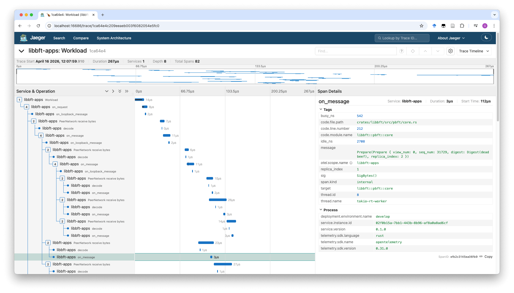
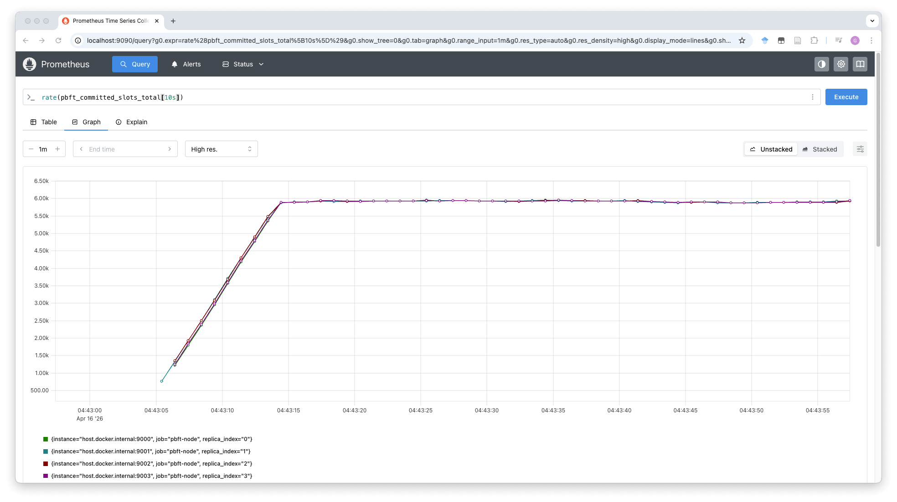
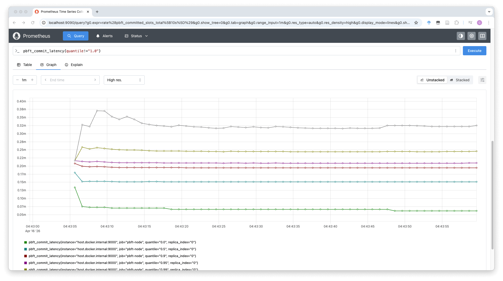

# $`\mathtt{lib}\beta\phi\tau`$

The academic codebase for painless BFT researching and evaluation.

## Highlights

**Perfect observability.**
The codebase is thoroughly instrumented and has distributed tracing and metrics set up.
No more meditation for reasoning about *where it stuck* or *why it runs so slow*.

Screenshots
  

**Streamlined protocol implementations in pure state machines.**
Core protocol logics are completely decoupled with peripheral I/O framework and are suitable for property-based testing.
Also optimized for self-contained and portability.

**Highly incremental development workflow.**
Start from (property-based) test cases.
Then in-process cluster with in-memory network.
Then multi-process cluster with localhost network.
Then bring your own cluster or AWS credential.
This codebase enables addressing issues with minimum infrastructures that can reproduce them before moving on to more involved setups.

**Performant and simple protocol code written in Rust.**
You probably cannot get better performance from any implementation with this amount of code.

## Quick Start

> Coming soon.
